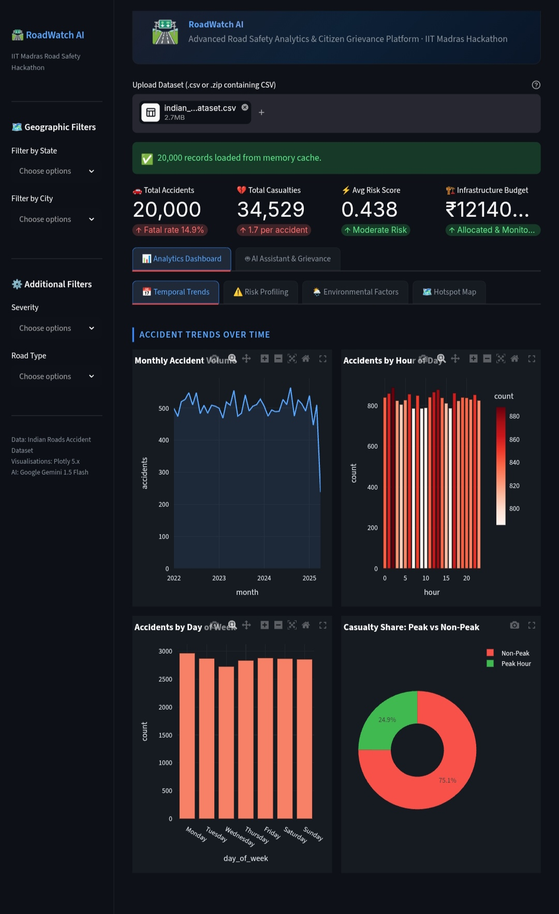
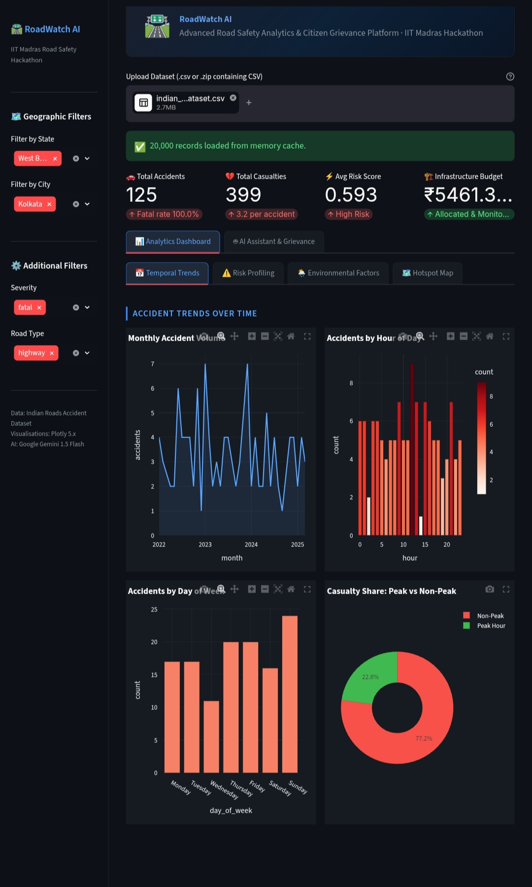
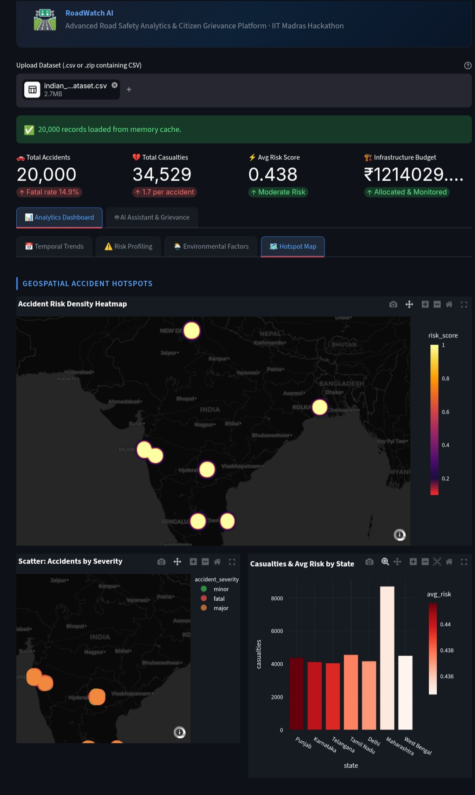
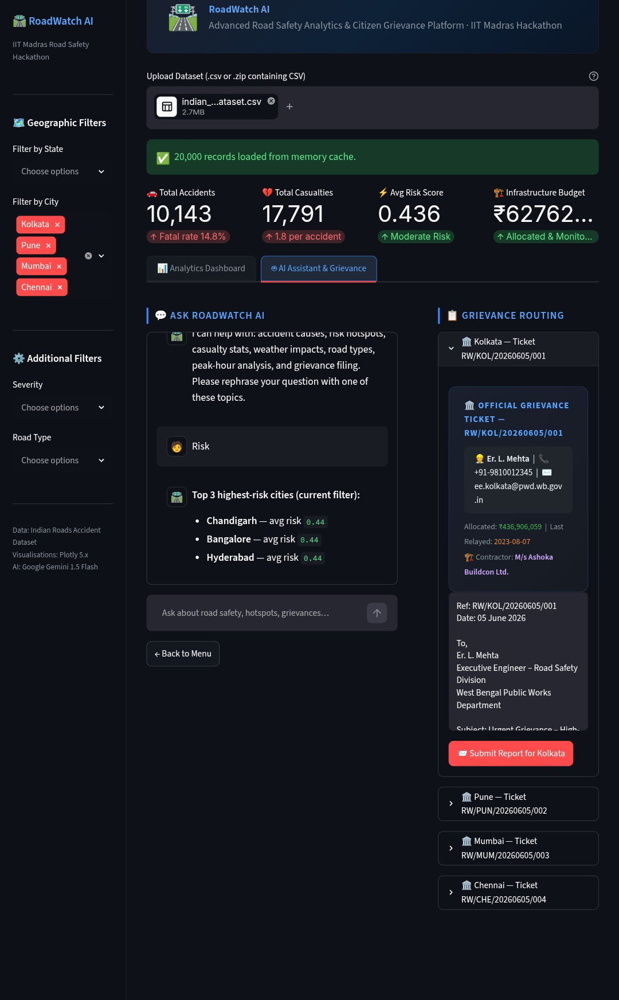

# 🛣️ RoadWatch AI

### AI-Powered Road Safety Analytics & Citizen Grievance Platform

Built for the **National Road Safety Hackathon 2026**
Organized by **Centre of Excellence for Road Safety (CoERS), IIT Madras**

🌐 Live Demo: https://roadwatchai.streamlit.app/

📂 GitHub Repository: https://github.com/IamDip-SK10/RoadWatch_AI

---

## Overview

RoadWatch AI is an intelligent road safety analytics and infrastructure transparency platform designed to empower citizens, engineers, and policymakers with data-driven insights.

The platform combines:

- 📊 Advanced road accident analytics
- 🗺️ Geospatial hotspot identification
- 🤖 AI-powered road safety assistant
- 📋 Automated grievance generation
- 🏗️ Contractor transparency tracking
- 💰 Infrastructure budget visibility
- 🏛️ Executive Engineer routing system

RoadWatch AI directly aligns with the IIT Madras RoadWatch challenge theme by promoting transparency, accountability, and citizen engagement in road infrastructure governance.

---

## Screenshots

### Analytics Dashboard


### Geospatial Hotspot Analysis


### AI Assistant & Grievance Routing


### Multi-City Infrastructure Transparency


---

# Key Features

## 📊 Advanced Analytics Dashboard

Interactive dashboard powered by Plotly visualizations:

- Monthly accident trends
- Hourly accident distribution
- Day-wise accident analysis
- Peak vs non-peak casualty analysis
- Severity distribution
- Environmental factor analysis
- Risk profiling
- State-wise casualty monitoring

---

## 🗺️ Geospatial Risk Intelligence

RoadWatch AI identifies accident-prone regions using:

- Geographic hotspot mapping
- Risk density visualization
- State-level accident clustering
- Location-based risk scoring

This helps authorities prioritize road safety interventions and infrastructure investments.

---

## 🤖 RoadWatch AI Assistant

Integrated with Google Gemini 1.5 Flash.

Capabilities include:

- Accident trend summaries
- Risk hotspot analysis
- Grievance guidance
- Road safety insights
- Infrastructure transparency queries

The assistant uses a hybrid architecture:

1. Dataset-driven local responses
2. Gemini-powered intelligent responses
3. Rule-based fallback engine

This ensures uninterrupted service even when AI APIs are unavailable.

---

## 📋 Automated Grievance Routing

Citizens can:

- Select one or multiple cities
- Generate official grievance tickets
- View responsible authorities
- Access infrastructure records
- Submit road safety complaints

Each ticket includes:

- Unique reference number
- Executive Engineer details
- Department information
- Budget allocation records
- Maintenance history
- Contractor information

---

## 🏗️ Contractor Transparency Module

A core innovation of RoadWatch AI.

For every selected city, users can view:

- Assigned contractor
- Infrastructure budget
- Last road relaying date
- Responsible department
- Executive Engineer information

This increases accountability and transparency in public infrastructure projects.

---

## 💰 Infrastructure Budget Monitoring

The platform enables monitoring of:

- Road maintenance budgets
- Infrastructure allocations
- City-wise spending visibility
- Budget accountability tracking

This bridges the transparency gap between public funds and infrastructure outcomes.

---

# System Architecture

```text
Dataset Upload
      │
      ▼
Data Validation Layer
      │
      ▼
Analytics Engine
      │
 ┌────┴────┐
 ▼         ▼
Dashboard  AI Assistant
 │          │
 ▼          ▼
Risk Maps  Gemini Integration
 │          │
 └────┬─────┘
      ▼
Grievance Routing Engine
      │
      ▼
Infrastructure Transparency Layer
```

---

# Technology Stack

| Layer | Technology |
|---------|------------|
| Frontend | Streamlit |
| Analytics | Pandas |
| Numerical Processing | NumPy |
| Visualization | Plotly |
| AI Assistant | Google Gemini 1.5 Flash |
| Mapping | Plotly Mapbox |
| Data Storage | CSV / ZIP Datasets |
| Deployment | Streamlit Community Cloud |

---

# Software Packages Used

| Package | Purpose |
|----------|----------|
| streamlit | Web application framework |
| pandas | Data manipulation |
| numpy | Numerical processing |
| plotly | Interactive visualizations |
| google-generativeai | Gemini AI integration |
| zipfile | ZIP dataset support |
| io | Memory-based file handling |
| datetime | Date operations |
| random | Deterministic infrastructure generation |

---

# Dataset Capabilities

The application supports datasets containing:

- Accident records
- Geographic coordinates
- Road types
- Severity levels
- Weather conditions
- Visibility metrics
- Traffic density
- Casualty information
- Risk scores

Supported formats:

- CSV
- ZIP containing CSV

---

# AI Design

RoadWatch AI uses a three-layer intelligence model:

### Layer 1 — Instant Dataset Responses

Answers generated directly from filtered datasets.

### Layer 2 — Gemini Intelligence

Complex questions routed to Gemini 1.5 Flash.

### Layer 3 — Fallback Engine

If Gemini is unavailable:

- No crash
- No interruption
- Automatic fallback responses

---

# RoadWatch Challenge Alignment

The project directly addresses the official RoadWatch theme:

✅ Road Quality Monitoring

✅ Public Infrastructure Transparency

✅ Citizen Grievance Management

✅ Contractor Accountability

✅ Budget Visibility

✅ Road Safety Analytics

✅ Data-Driven Governance

✅ AI-Assisted Decision Support

---

# Future Enhancements

- Real-time government API integration
- Mobile application
- Image-based road damage detection
- Predictive accident forecasting
- Smart contractor performance scoring
- Live infrastructure monitoring
- Citizen reputation system
- GIS-based route safety recommendation

---

# Developer

**Subhadip Kumar**

Team: **Team Subhadip**

Role:
- Full Stack Development
- Data Analytics
- AI Integration
- Visualization Design
- Documentation
- Deployment

Built independently as a solo submission for the National Road Safety Hackathon 2026.

---

# License

MIT License

This project is provided for educational, research, and hackathon purposes.
